# GestureRecognition
Real time gesture recognition of some common gestures as shown below. The [egoGesture dataset](http://www.nlpr.ia.ac.cn/iva/yfzhang/datasets/egogesture.html) was used for the training of this model.

Y. Zhang, C. Cao, J. Cheng and H. Lu, "EgoGesture: A New Dataset and Benchmark for Egocentric Hand Gesture Recognition," IEEE Transactions on Multimedia (T-MM),Vol.20, No.5, pp.1038-1050, 2018.

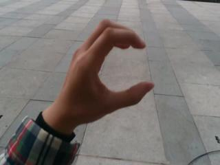
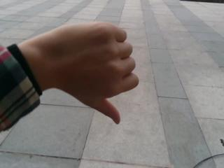
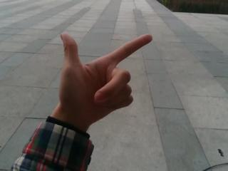
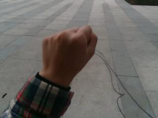

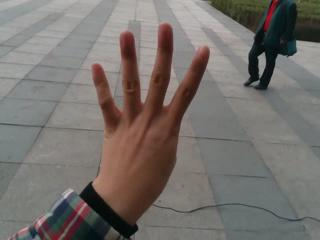
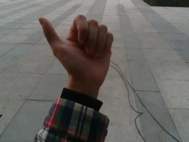
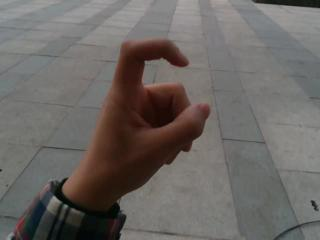
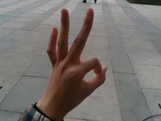
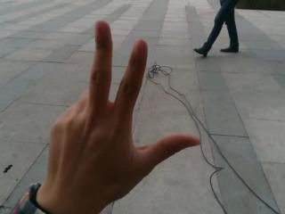
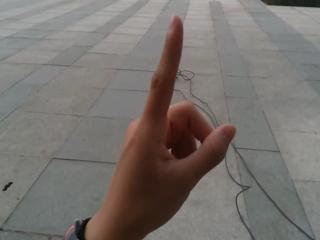
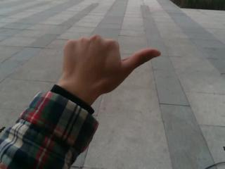
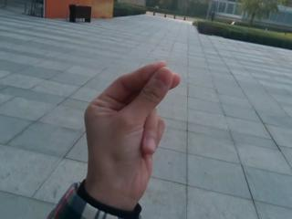
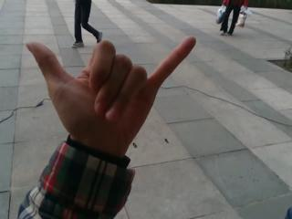
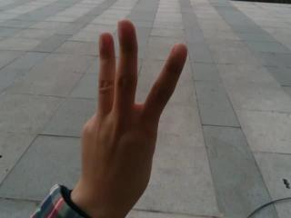
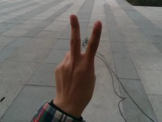
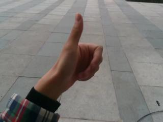
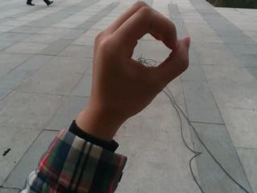

## Using the model
Clone the repo onto your system

`pip install -r requirements.txt`

Run vizualization.ipynb
