<h1 align="center">🄶🄴🅂🅃🅄🅁🄴 🅁🄴🄲🄾🄶🄽🄸🅃🄸🄾🄽</h1>

## Using the model
1. Clone the repository using git  
`git clone https://github.com/ikathuria/GestureRecognition.git`

2. Navigate to that folder  
`cd GestureRecognition`

3. Install all the dependencies  
`pip install -r requirements.txt`

4. Run the visualization file to see the outputs  
`python visualization.py`

## The gestures
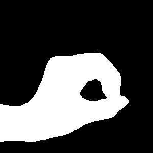

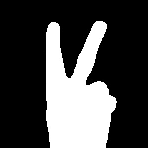
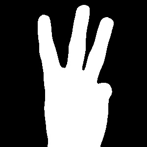
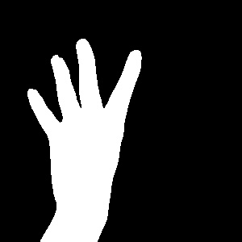
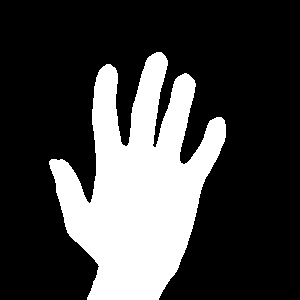
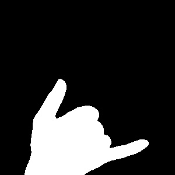
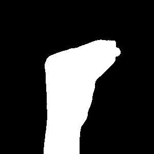
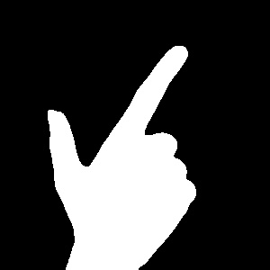
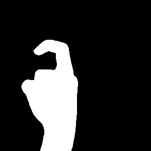

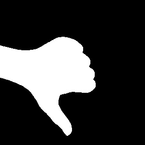
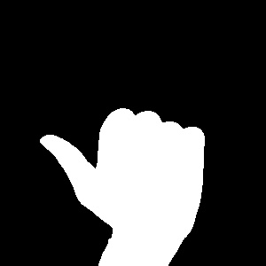
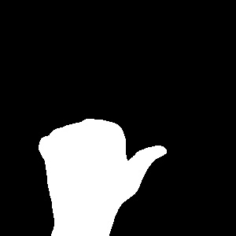

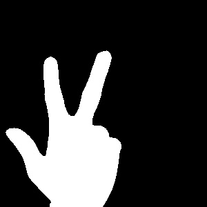
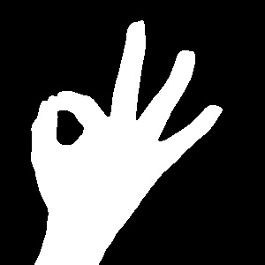

## TODO
Add depth estimation
